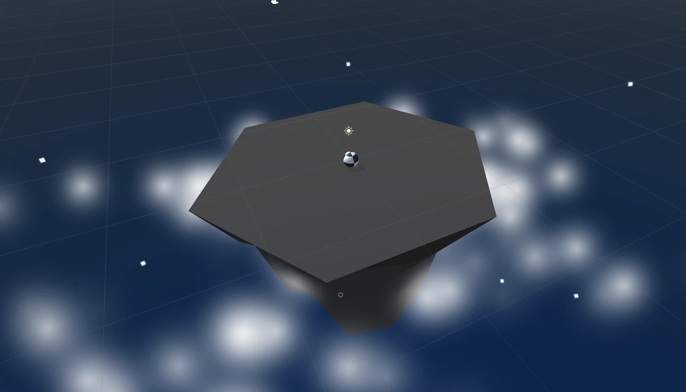

# Overview

First things first, we will create a new prototype and download the starter files! You’ll notice a beautiful island, sky, and particle effect... all of which can be customized!

After creating a new project and importing our assets, it's time to get started with the player controls. First we'll allow the player to rotate the camera around the island, providing a glorious view of the scene. The player will be represented by a sphere, wrapped in a detailed texture of your choice. Finally we'll will add force to the player, allowing them to move forwards or backwards in the direction of the camera.

<!-- Don't edit links here, change them in _data/assignment.yml instead, -->

[lesson]: <{{site.data.assignment.lesson}}>     
[slides]:   <{{site.data.assignment.slides}}>   
[template]: <{{site.data.assignment.template}}> 
